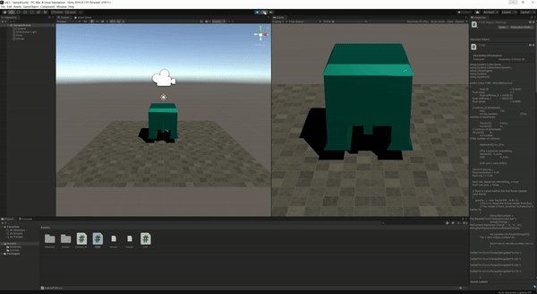

# GAMES103 Lab3


This is a simple implementation of FVM ([**F**inite **V**olume **E**lement](https://en.wikipedia.org/wiki/Finite_volume_method)).
## Instruction
1. Download ```lab3.unitypackage``` and import it into a Unity project.
2. Open the Sample Scene.
3. Click ```Play``` button and see the little house falling.